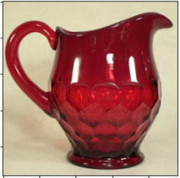
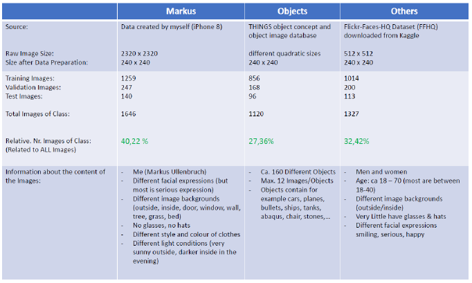
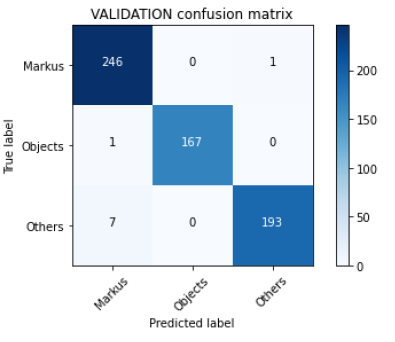
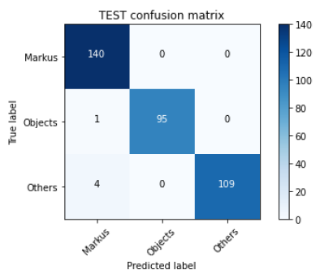
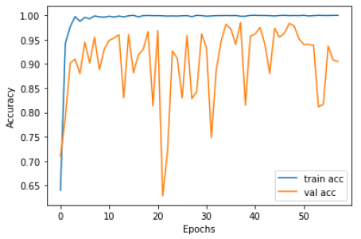

# Deep Learning Face Recognition
## Transfer Learning based classifier of faces

# Overview
 Building a deep learning face recognition system using transfer learning.
 The classifier can classify

 - my own face "Markus"
 
 
 
 - faces of other human beings "others"
 - some random "objects".
 
 # Data
 

  

 
# Results
Even if my brother who is looking a lot like me is not available in the whole dataset the classifier is trained on, most pictures of my brother are classified correctly as "Others".
## Confusion Matrix on Validation and Test Dataset
 

## Training & Validation Accuracy

  

# Additional Info
To train with your own data you have to fill the Dataset folder with your own images and images of objects and other human faces.
To train on other categories than your face, others and objects, you can adapt the code and the dataset folder containing the images to your own data categories.
The code is very well documented with markdown cells containing explanations and the code has many comments.

If you find some issue or you have quastions about the code or the topic, please contact me via e-mail :)
